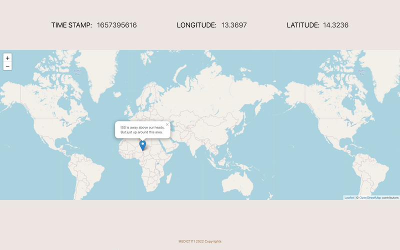

# ISS-TRACKER

## THE PROJECT

App that tracks the International Space Station location in relation to Earth

## TECH

- HTML, CSS, JS
- Leaflet and NASA API

## Installing

1. Fork project
2. Open your terminal and run `git clone` followed by the url of this repo
3. Open html directly ont he browser, or with live server extension

> Developer: Aryse Pagano: Self Taught Full Stack Web Developer
